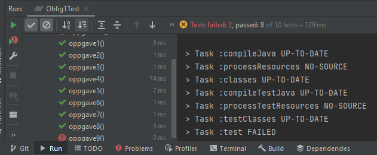

# Obligatorisk oppgave 1 i Algoritmer og Datastrukturer

Denne oppgaven er en innlevering i Algoritmer og Datastrukturer. 
Oppgaven er levert av følgende student:
* Pedram Ziaei, S362046, s362046@oslomet.no

# Arbeidsfordeling

I oppgaven har vi hatt følgende arbeidsfordeling:
* Pedram har hatt hovedansvar for oppgave 1-8. alle har blitt testet også.
* 

# Oppgavebeskrivelse

opp1 >> en for løkke som sjekker verdiene til indeksene og setter den som er større enn den andre. og da
returneres største tallet.  en teller funksjon som teller hvor mange ganger verdier har blitt sammenlignet
for å komme til den største tallet. I tillegg har en funskjon for tømme tabeller som blir skrevet en 
feilmelding ut til brukeren.

Når blir det flest ombyttinger?
Det blir flest ombyttninger om arrayet er sortert "feil vei". DVS fra minst til størst.
Når blir det færrest?
Når listen er sortert "riktig vei", DVS fra størst til minst

opp2 >> en for løkke som looper gjennom arrayet for å se om det finnes større tall enn det utvalget og
da byttes det tallet med den større tallet. hver gang dette skjer så teller går en opp.
har i tillegg exception funskjon som kastes om arrayet er ikke sortert stigende.

opp3 >> oppgaven handlet om finne antall uniketall i arrayet vårt og da måtte jeg bruke boolean for å unngå
duplikater. deretter om det ikke ble funnet to eller flere for en verdi så uniketallet gikk opp.

opp4 >> sorterer arrayet med quicksort. etter det så ble satt en for løkke for å loope gjennom arrayet
og sette partallene samme og ellers er de oddetall så settes de også sammen. etter at de ble sortert så brukte
en metode for quick-sort med venstre og høyre side for å ha odde og par tallene for sin side. da fant jeg med pivoten
midten av arrayet og fikset resten der ifra.

opp5 >>  I tillegg hadde en if test som sier hvis arrayet har en eller null elementer så skrives selve arrayet ut siden
det blir ikke noe rotasjon på en verdig eller nullverdig array. men metodene er satt sånn at de får inn lengde 
og ønskende endringposjonen og da begynner elemente flyttes(brukte arraycopy).

opp 7 >> 
a) String builder setter s og t sammen til en string og da går de gjennom en for_løkke som bruker arrayet sin lengde
og s, t sin lengde for å finne om de finnes mindre/nærmere verdi for. resultatet blir skreivet ut i en tostring.

b)
i den delen lagen ny string builder som tar utgangspunket på summen av array sin lengde og hvis ordet er større
enn array sin lengde så skrives ut. så har vi en while løkke for å sjekke telleren mot stringen om det finnes 
enn større så skrives ut hvis ikke så er det if setning for oppstart ellers forsettes i++ til vi looper ut.
til slutt to stringen skrives ut også.